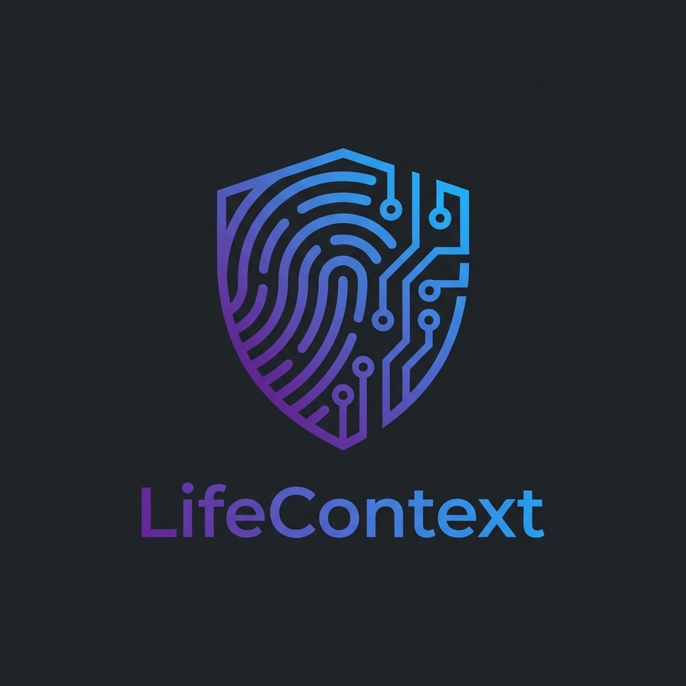

# LifeContext

<div align="center">
  
  <br/>

  **The Operating System for Your Life's Context.**
  <br/>
  *Because your brain is a terrible hard drive.*
  <br/>
  <br/>

  [](https://opensource.org/licenses/MIT)
  []()
  []()
  []()
</div>

---

## Why does this exist?

**Context is King, but yours is scattered.**

You have a million thoughts, lessons, and memories scattering into the void every day. Most tools (notes, journals) are static silos. They don't help you see the big picture.

**LifeContext** is a purpose-built vault for your consciousness. **We are not a therapist.** We are the ultimate Context Gathering Engine where you organize your thoughts so you (or your actual therapist) can make sense of them.

- **For You**: Gather your scattered context into one coherent timeline.
- **For Your Professional Support**: Export a "Context Packet" for your therapist so they don't have to spend 6 sessions just learning your history.
- **For Your Legacy**: A truthful, nuanced archive of who you really were, safely encrypted.

---

## Project Structure

This is a **TurboRepo monorepo** with the following structure:

```
LifeContextCompiler/
├── apps/
│   ├── web/                    # React/Vite web application
│   └── mobile/                 # React Native (Expo) mobile app
├── packages/
│   ├── audio/                  # Audio recording & waveform utilities
│   ├── core/                   # Shared business logic (stores, hooks)
│   ├── encryption/             # AES-256-GCM client-side encryption
│   ├── llm/                    # AI integration (Anthropic, Ollama)
│   ├── storage/                # Local-first DB + remote sync drivers
│   ├── types/                  # Shared TypeScript types
│   ├── eslint-config/          # Shared ESLint configuration
│   └── typescript-config/      # Shared TypeScript configuration
└── docs/                       # Documentation
```

---

## Features

### 1. Brain Dump Engine
Stop trying to organize your thoughts before you write them. Just talk.
- **Voice-First**: Ramble for 30 minutes with screen-wake-lock enabled
- **Live Transcription**: See your words as you speak (Web Speech API + Whisper)
- **AI Synthesis**: Claude organizes your thoughts, finds contradictions, and asks clarifying questions
- **Iterative Refinement**: Answer follow-up questions to refine your context

### 2. Zero-Knowledge Privacy
We know nothing. Seriously.
- **Client-Side Encryption**: AES-256-GCM with PBKDF2 key derivation (100,000 iterations)
- **Opaque Sync**: Server only sees encrypted blobs (`U2FsdGVkX1...`)
- **Local-First**: Works perfectly offline - your data stays on your device
- **Emergency Access**: Shamir's Secret Sharing to split your master key among trusted contacts

### 3. Emotional Intelligence
- **Mood Tracking**: Daily check-ins with energy levels
- **Trend Analysis**: Detect patterns over weeks and months
- **Proactive Prompts**: Anniversary reminders, gap detection, mood-based suggestions
- **Life Chapters**: Automatic detection of major life transitions

### 4. Legacy Building
- Answer hundreds of curated questions about your life
- Export everything to open formats (JSON, Markdown, MP3)
- Ensure future generations understand not just what happened, but why

---

## Future-Proofing (The "Data Lake")

**Why store raw video?**

AI models today are amazing. In 10 years, they will be godlike.

By keeping your **Raw Video/Audio** (stored wherever YOU like - S3, Local Drive, NAS), you enable future AIs to re-process your life with clearer eyes.

- **Micro-Expressions**: Detecting hidden emotions we miss today
- **Voice Tonality**: Analyzing stress levels over decades
- **Your Data, Your Drive**: Configure the app to dump raw assets to your own AWS S3 bucket or local hard drive

---

## Why Trust Us? (Don't.)

Seriously. **Do not trust us.**

We built LifeContext because we don't trust Big Tech, and frankly, you shouldn't trust us either.

**Our Guarantee**: Even if we become the villains in the future, your data is safe.

1. **Client-Side Only**: Encryption happens on your CPU. We never see the key.
2. **Open Source**: You can inspect every line of code.
3. **Self-Hostable**: Fork this repo and run it on your own server.

**Your data is yours.** Not "yours until we change our TOS." Yours. Period.

---

## Philosophy: The Tool, Not The Friend

In an era of "AI Companions" designed to simulate intimacy for retention, LifeContext stands apart.

**We are a mirror, not a lover.**

### Why Most Apps Want You Addicted

Modern tech companies have discovered something insidious: **emotional attachment drives engagement**.

- **Streaks**: Miss a day? Feel guilty. That's by design.
- **AI Companions**: "I missed you!" No, it's a server that ran a cron job.
- **Notifications**: Carefully timed to trigger dopamine at optimal hours.
- **Infinite Scroll**: Your attention is the product being sold to advertisers.

The Attention Economy is built on one truth: **the more you scroll, the more ads you see, the more data we can sell about you**.

Your diary app shouldn't be part of this machine.

### How We're Different

| Them | Us |
|------|----|
| Streaks and badges to gamify your habits | No manipulation. Use it when it helps you. |
| "I missed you" messages from AI | "You haven't written in 3 days. Would you like to note this gap?" |
| Data sold to advertisers | Your data never leaves your device |
| Designed to maximize time-in-app | Designed to maximize insight-per-minute |
| Lock-in via proprietary formats | Export everything (JSON, Markdown, MP3) |

### Leveling the Playing Field

Big Tech companies have been hoarding your data for decades. They know:
- What you search for at 2am
- Who you text when you're sad
- What products you buy when stressed

**They use this data to build psychological profiles to sell you things.**

LifeContext flips the script. **You** get the same power they have, but for your own benefit:
- See your own emotional patterns over years
- Understand your decision-making trends
- Build a context engine that works *for* you, not for advertisers

> "The most dangerous data is the data you don't know you're generating."

### The Bottom Line

- **No Gamification**: We don't use streaks or badges to manipulate your dopamine.
- **No Emotional Attachment**: Our AI is a supportive *analyst*, not a fake friend.
- **Data Sovereignty**: The Attention Economy relies on your data being trapped. We build escape hatches first.

---

## Tech Stack

### Web Application (`apps/web`)
- **Framework**: React 18 + Vite 5
- **Styling**: Tailwind CSS v4 + ShadCN UI
- **State**: Zustand with localStorage persistence
- **Database**: IndexedDB (Dexie.js) - local-first
- **Encryption**: Web Crypto API (AES-256-GCM, PBKDF2, HKDF)
- **Deployment**: Render (Static Site)

### Mobile Application (`apps/mobile`)
- **Framework**: React Native (Expo SDK 52)
- **Routing**: Expo Router v4 (file-based)
- **Styling**: NativeWind v4 (Tailwind for RN)
- **Storage**: MMKV (fast key-value storage)
- **Audio**: expo-av with background recording
- **Haptics**: expo-haptics for tactile feedback

### Shared Packages
- **@lcc/core**: Zustand stores, business logic hooks, utilities
- **@lcc/encryption**: AES-256-GCM, PBKDF2, Shamir's Secret Sharing
- **@lcc/storage**: IndexedDB + S3/filesystem sync drivers
- **@lcc/audio**: Audio recording, waveform visualization
- **@lcc/llm**: Claude/Ollama integration for synthesis

---

## Quick Start

### Prerequisites
- Node.js 18+ (LTS recommended)
- pnpm 8.15+ (required for monorepo)

### Installation

```bash
# Clone the repo
git clone https://github.com/your-org/LifeContextCompiler.git
cd LifeContextCompiler

# Install dependencies
pnpm install

# Start the web app
pnpm --filter @lcc/web dev
```

Open `http://localhost:5173` and start documenting your life.

### Mobile Development

```bash
# Start Expo dev server
cd apps/mobile
pnpm start

# Or run on specific platform
pnpm ios
pnpm android
```

---

## Environment Variables

Create a `.env` file in `apps/web` for optional features:

```env
# Optional: Your own Anthropic API key for AI synthesis
VITE_ANTHROPIC_API_KEY=sk-ant-...

# Optional: OpenAI API key for Whisper transcription
VITE_OPENAI_API_KEY=sk-...
```

---

## Mobile Support

### PWA (Progressive Web App)
1. Open the site on Safari (iOS) or Chrome (Android)
2. Tap "Share" -> "Add to Home Screen"
3. Full-screen, offline-capable app

### Native App (Coming Soon)
The `apps/mobile` directory contains a full React Native (Expo) app with:
- Haptic feedback on all interactions
- Background audio recording
- Native file system access
- Same codebase as web via `@lcc/core`

---

## Security Architecture

```
┌──────────────────────────────────────────────────────────┐
│                      YOUR DEVICE                          │
│  ┌─────────────┐    ┌─────────────┐    ┌──────────────┐ │
│  │  Your Data  │───▶│  Encryption │───▶│  IndexedDB   │ │
│  │  (Plaintext)│    │  (AES-256)  │    │  (Encrypted) │ │
│  └─────────────┘    └─────────────┘    └──────────────┘ │
│                            │                              │
│                            ▼                              │
│                    ┌───────────────┐                      │
│                    │ PBKDF2 Key    │                      │
│                    │ (from password)│                     │
│                    └───────────────┘                      │
└──────────────────────────────────────────────────────────┘
                            │
                            ▼ (Encrypted Blobs Only)
┌──────────────────────────────────────────────────────────┐
│                    SYNC SERVER (Optional)                 │
│                                                           │
│         "U2FsdGVkX1+..." (We see gibberish)              │
│                                                           │
└──────────────────────────────────────────────────────────┘
```

---

## Contributing

1. Fork the repository
2. Create your feature branch (`git checkout -b feature/amazing-feature`)
3. Commit your changes (`git commit -m 'Add amazing feature'`)
4. Push to the branch (`git push origin feature/amazing-feature`)
5. Open a Pull Request

---

## License

**MIT License**

Steal this code. Fork it. Make it better. Just don't make it track people, or we'll be very disappointed in you.

---

<div align="center">
  <br/>
  <strong>Made with existential dread and too much coffee.</strong>
  <br/>
  <em>Your data never leaves your device unless you explicitly tell it to.</em>
</div>
